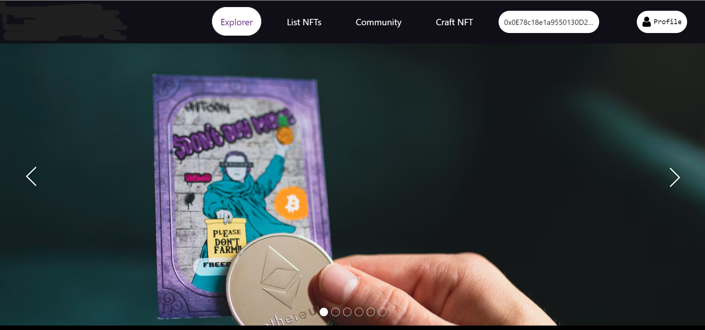

# NFT Marketplace



## Table of Contents
- [Introduction](#introduction)
- [Features](#features)
- [Requirements](#requirements)
- [Installation](#installation)
- [Usage](#usage)
  - [Creating NFT](#creating-nft)
  - [Listing NFT](#listing-nft)
  - [Fetching User's NFTs](#fetching-users-nfts)
  - [Fetching Listed NFTs](#fetching-listed-nfts)


## Introduction
Welcome to the NFT Marketplace, a decentralized platform built using React for creating, listing, and managing Non-Fungible Tokens (NFTs). This application allows users to mint their own NFTs, list them for sale on the marketplace, and fetch NFTs associated with a specific wallet address.

## Features
1. **Create NFTs:** Users can mint their own unique NFTs with custom metadata and attributes.
2. **List NFTs:** NFT creators can list their tokens for sale on the marketplace, specifying the price and other details.
3. **Fetch User's NFTs:** Users can retrieve a list of NFTs associated with a particular wallet address.
4. **Fetch Listed NFTs:** Users can view all NFTs listed for sale on the marketplace.

## Requirements
- Node.js
- npm or yarn
- MetaMask or any compatible Ethereum wallet

## Installation
1. Clone the repository:
    ```bash
    git clone https://github.com/Shrey-Gajjar-9798/NFTMarketplace.git
    ```
2. Navigate to the project directory:
    ```bash
    cd test
    ```
3. Install dependencies:
    ```bash
    npm install
    ```
    or
    ```bash
    yarn install
    ```

## Usage

### Creating NFT
1. Run the development server:
    ```bash
    npm start
    ```
    or
    ```bash
    yarn start
    ```
2. Visit http://localhost:3000 in your browser.
3. Connect your wallet (e.g., MetaMask).
4. Navigate to the "Craft NFT" section and follow the on-screen instructions to mint your NFT.

### Listing NFT
1. Ensure you have created an NFT using the steps above.
2. Navigate to the "List NFT" section.
3. Specify the details (price, etc.) and list your NFT.

### Fetching User's NFTs
1. Connect your wallet (e.g., MetaMask).
2. Navigate to the "My Profile" section.
3. Click on the My-NFT button to fetch your NFTs attached with wallet address
